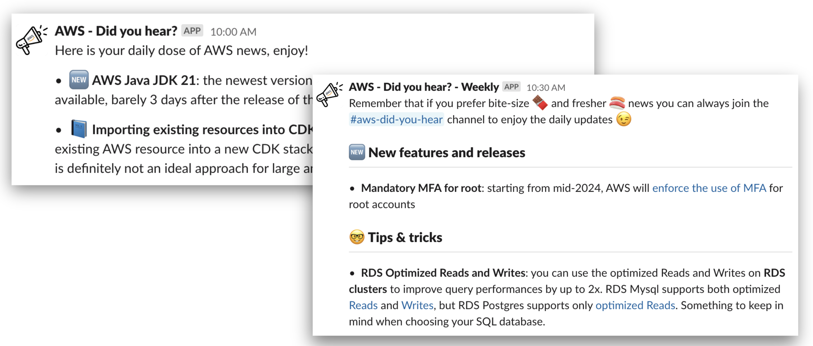
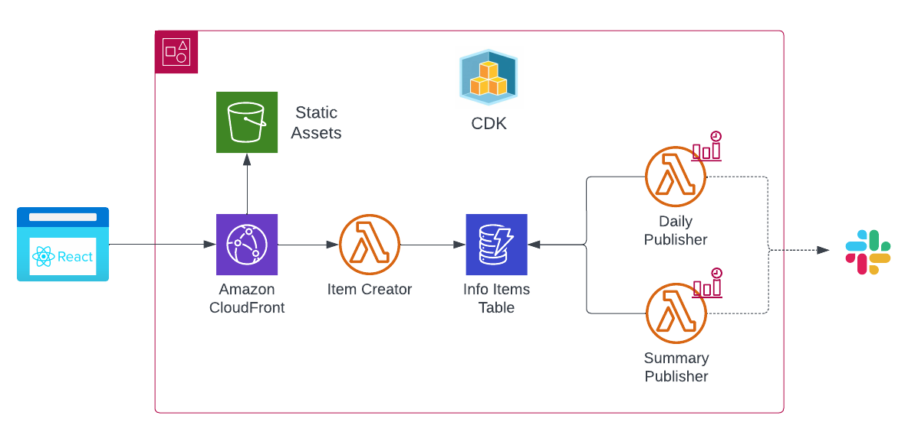
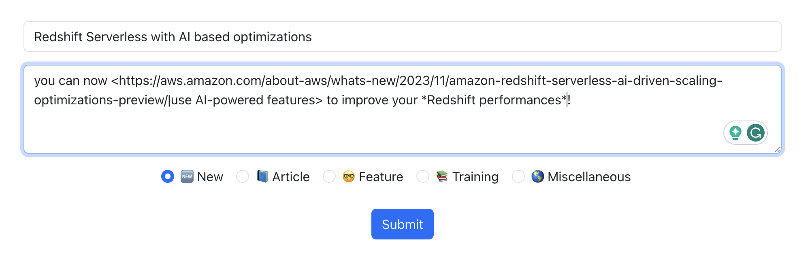

# Did-you-hear Publisher Slack App

## What is it?

This project is the backend of a Slack bot designed to publish daily news and regular summaries about news worthy topics. We use it internally to publish regular updates about AWS services and publications.

The **serverless** infrastructure necessary is deployed to AWS using [AWS CDK](https://docs.aws.amazon.com/cdk/v2/guide/home.html).



### Background

This tool was built to make gathering and sharing AWS related news on our company Slack channels.

The manual process before we had this tool required to:

- take note of any interesting news or articles we found along our day
- once a day go on Slack and publish a daily message listing those news/articles on a dedicated channel
- once a week gather all the daily updates in the form of a summary on the main tech channel

This was a very time consuming and error prone process, especially when it came to gathering the content and formatting the Slack messages.

### Components and architecture

This application is composed of 3 main components, which compose the overall architecture: 



#### UI Frontend

The first component is a simple React-based UI, in which you can enter the content. The syntax used for Urls and other special formatting is the [Slack API syntax](https://api.slack.com/reference/surfaces/formatting).  



#### UI Backend

The second component is composed of a CloudFront distribution connected with a Lambda via Lambda URL, which saves the content to a DynamoDB table.

#### Publishers

The last component is made up of two lambdas, one for the daily publication and one for the regular/weekly publication (the regularity is configurable). Both Lambdas regularly check in the DynamoDB table what news need to be published and record the succesful publication to avoid duplications.

## Deployment

Currently the deployment is done from local via the CLI, with the possibility to deploy either to a `Development` or `Production` environment. 

### Setup

The following environment variables must exist:

```
export DEV_ACCOUNT=12345678       # AWS development account ID
export DEV_REGION=eu-central-1    # AWS development region
export PROD_ACCOUNT=12345678      # AWS production account ID
export PROD_REGION=eu-central-1   # AWS production region

export SLACK_DAILY_URL=https://hooks.slack.com/services/sfsfsdfsdfs  # Slack webhook URL for the daily publication 
export SLACK_SUMMARY_URL=https://hooks.slack.com/services/sdfsdfafd  # Slack webhook URL for the summary publication
```

The Slack URL will be read by the backend Lambdas in the SSM Parameter Store. You can create the necessary secrets by using the following commands:

```bash
aws ssm put-parameter --name /Publisher/SlackDailyUrl --value $SLACK_DAILY_URL --type SecureString
aws ssm put-parameter --name /Publisher/SlackSummaryUrl --value $SLACK_SUMMARY_URL --type SecureString
```

### Deploy via CDK

In a new account, you will first need to bootstrap CDK:

```bash
cd cdk
npm i
npx cdk bootstrap
```

Then run the cdk deployment, from the **root** of the project:

```bash
npm i

npm run deploy -- -c env=dev
# or
npm run deploy -- -c env=prod
```

Once deployed, you can find the URL of the UI in the outputs of the CDK command. 

## Development


## Warnings

The Lambda URL deployed is **currently NOT PROTECTED**, so anyone that finds your Lambda URL can use it to push "content" via your Lambda. The next step in this project is to make the URL protected via CloudFront + IAM.

## Improvements planned

- CI/CD pipelines
- unit and integration tests
- e2e tests
- more options for configuration